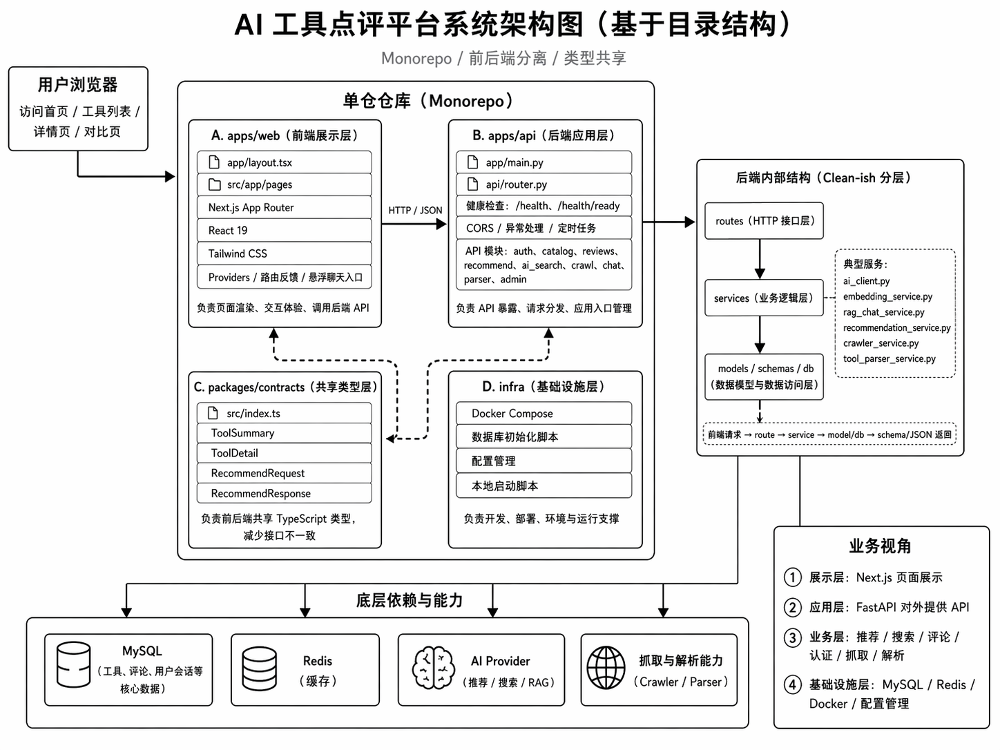

# 星点评（Xingdianping）

星点评是一个 AI 工具发现、评测、对比与推荐平台，定位为“AI 工具版大众点评 / 豆瓣”。项目采用 monorepo 组织，前端负责产品体验与目录展示，后端负责工具数据、评论、推荐、AI 搜索与管理能力。

线上当前推荐版本：https://xingdianping.vercel.app/

## 架构总览



核心链路：

- 用户通过首页、工具目录、详情页、对比页、榜单页和场景页发现工具。
- Next.js 前端通过 HTTP/JSON 调用 FastAPI 后端接口。
- FastAPI 按 routes → services → models / schemas / db 分层组织业务。
- MySQL 存储工具、评论、用户会话等核心数据，Redis 负责缓存。
- AI Provider 承接推荐、搜索、RAG 对话等能力。
- `packages/contracts` 维护前后端共享 TypeScript 类型，降低接口漂移风险。

## 当前产品能力

- 首页统一主入口，支持直接搜索和 AI 帮找。
- 工具目录页支持搜索、筛选、排序、分页和目录状态保持。
- 工具详情页支持基础信息、标签、评分、评论、相似工具推荐。
- 榜单页、场景页、对比页、认证页和匹配页具备可运行体验。
- 后台管理支持工具、评论、榜单等内容维护路径。
- AI 搜索链路接入 `/api/ai-search`，支持基础意图理解、推荐和降级。
- 聊天 / RAG 相关服务已按可替换 AI Provider 方式组织。

## 技术栈

- 前端：Next.js 15、React 19、TypeScript、Tailwind CSS 4、Vitest、Playwright
- 后端：FastAPI 0.115+、SQLAlchemy 2.0、Alembic、Pydantic、PyMySQL、Pytest
- 数据与缓存：MySQL 8.4、Redis 7.4
- 工程化：npm workspaces、共享 contracts、Docker Compose、本地一键启动脚本

## 项目结构

```text
apps/
  api/                  FastAPI 后端服务、模型、服务层、迁移与测试
  web/                  Next.js 前端应用、页面、组件、样式与测试
packages/
  contracts/            前后端共享 TypeScript 类型
infra/
  docker/               本地 MySQL / Redis Docker Compose 配置
  sql/                  数据库初始化脚本
doc/                    产品、页面、交互、技术架构与设计文档
docs/                   阶段性交接、测试、专项方案和自动基线文档
scripts/                根目录开发、文档同步和工程脚本
archive/drawer/         历史归档代码，不参与当前运行路径
```

## 本地启动

推荐使用根目录一键脚本：

```bash
npm install
npm start
```

停止或重启：

```bash
npm run stop
npm run restart
```

仅启动前端：

```bash
npm run dev
```

后端单独开发：

```bash
cd apps/api
pip install -e .[dev]
alembic upgrade head
python -m pytest
python -m uvicorn app.main:app --reload --host 0.0.0.0 --port 8000
```

## 常用命令

```bash
npm run build:web
npm run lint:web
npm run test:web
npm run docs:sync
npm run docs:check
npm run organize:aitool
npm run validate:aitool:preview
npm run import:aitool:preview
npm run import:aitool:all
```

## 配置说明

- 首次启动会按 `.env.example` 生成 `.env`。
- 数据库与 Redis 可通过 `infra/docker/docker-compose.yml` 启动。
- AI 模型凭证可以写入用户本地创建的 `秘钥.txt`，启动脚本会尝试解析模型名、base URL 和 API key。
- 开发端口会自动避让已占用端口，默认优先使用 API `8000`、Web `3000`。

## 开发约定

- 当前运行路径只包含 `apps/api`、`apps/web`、`packages/contracts` 和必要基础设施。
- `archive/drawer/` 只作历史参考，不参与新功能开发、构建、测试或运行。
- 如果文档与代码不一致，先以代码为准，再回写文档。
- 页面布局、信息架构和交互口径优先参考 `doc/`。
- 阶段性交接、测试范围和专项说明优先参考 `docs/`。
- `docs/current-implementation-baseline.md` 由代码自动生成，提交前可运行 `npm run docs:check` 校验。

## 部署

前端当前部署在 Vercel：

- Production：https://xingdianping.vercel.app/

后端支持本地 FastAPI 运行，也保留 Railway / Docker 相关生产部署配置。正式部署前请确认环境变量、数据库迁移、Redis 连接和 AI Provider 凭证均已配置。
